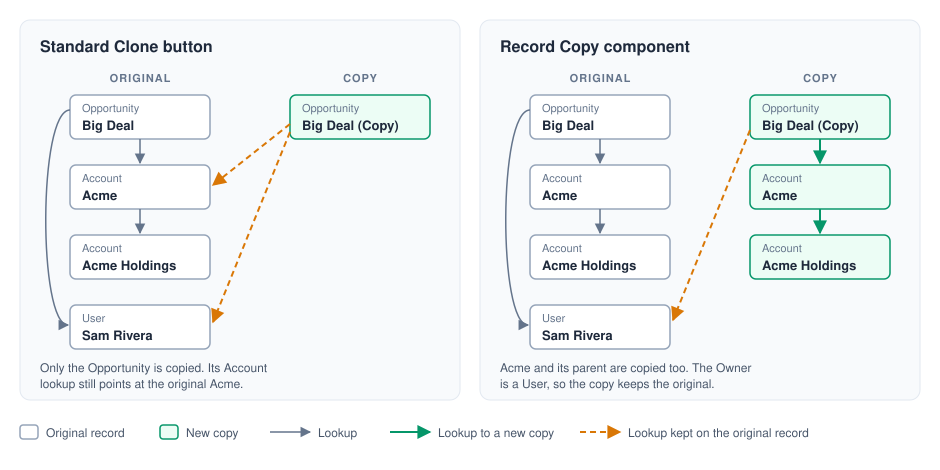
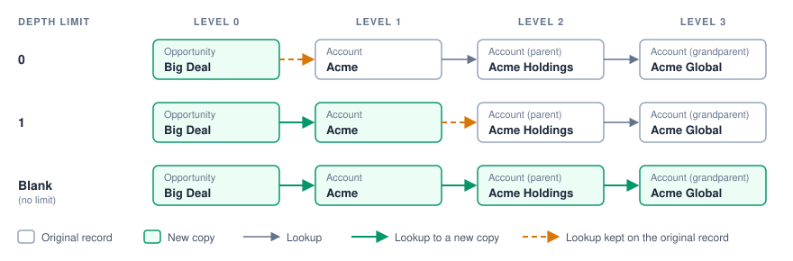
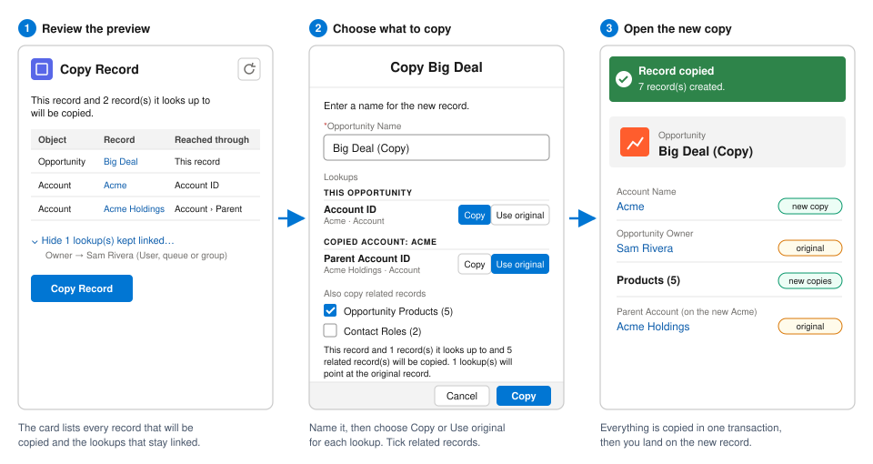
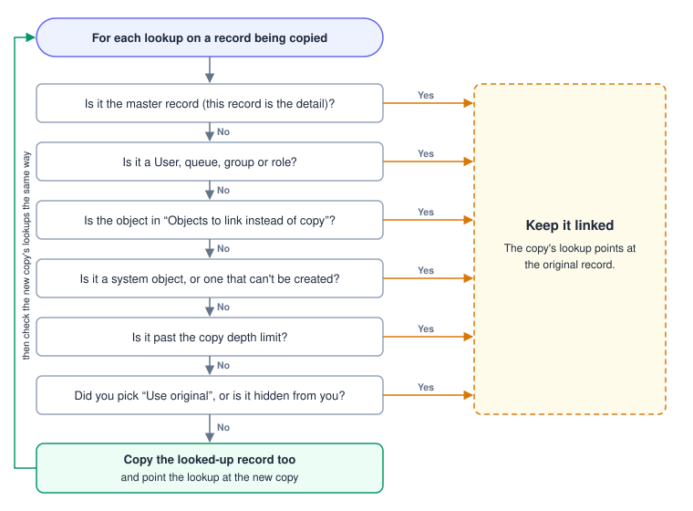

# Salesforce Record Clone

A Lightning Web Component that copies a record from its record page. It also copies the records that record looks up to, and it can copy the record's related (child) records as well.

The standard **Clone** button copies one record, and every lookup on the copy still points at the original records. **Record Copy** follows the lookups: it copies the records they point to (and the records those point to, and so on) and wires the new copies together. Masters, users, queues and any objects you choose stay linked to the originals.



## What's included

| Type                 | Name                     | Purpose                                                                |
| -------------------- | ------------------------ | ---------------------------------------------------------------------- |
| LWC                  | `recordClone`            | The **Record Copy** component you drop on a record page                |
| LWC                  | `recordCloneNameModal`   | Modal that asks for the new record's name and which related records to copy |
| Apex class           | `RecordCloneController`  | `@AuraEnabled` methods called by the LWC                               |
| Apex class           | `RecordCloneService`     | All of the copy logic                                                  |
| Apex class           | `RecordCloneServiceTest` | Unit tests                                                             |
| Permission set       | `Record_Clone_User`      | Grants access to `RecordCloneController`                               |
| Manifest             | `manifest/recordClone.xml` | Package manifest listing all of the above                            |

## Installation

### Prerequisites

- [Salesforce CLI](https://developer.salesforce.com/tools/salesforcecli) (`sf`)
- An org to deploy to (sandbox, Developer Edition, or scratch org). The LWC is built on API version 67.0, so the org must support it.

### 1. Get the source

```bash
git clone <this-repo-url>
cd salesforce-object-clone
```

### 2. Authorize your org

```bash
# Production / Developer Edition
sf org login web --alias my-org

# Sandbox
sf org login web --alias my-org --instance-url https://test.salesforce.com
```

### 3. Deploy

Deploy using the manifest and run the included tests:

```bash
sf project deploy start --manifest manifest/recordClone.xml --target-org my-org --test-level RunSpecifiedTests --tests RecordCloneServiceTest
```

For a sandbox or scratch org you can skip the tests:

```bash
sf project deploy start --manifest manifest/recordClone.xml --target-org my-org
```

### 4. Assign the permission set

Every user who will copy records needs the **Record Clone User** permission set:

```bash
sf org assign permset --name Record_Clone_User --target-org my-org
```

Or in Setup: **Users → Permission Sets → Record Clone User → Manage Assignments → Add Assignment**.

The permission set only grants access to the Apex controller. Copies run in user mode, so users also need **Create** access on every object that gets copied and **Read** access on the records being copied. Only fields the user can read and create are copied.

## Adding the component to a record page

1. Open a record of the object you want to copy (for example, an Opportunity).
2. Click the gear icon → **Edit Page** to open Lightning App Builder.
3. In the **Components** panel, find **Record Copy** under **Custom**.
4. Drag it onto the page.
5. Set the component properties (see below).
6. Click **Save**. If this is the first time the page is customized, click **Activate** and assign it as the org default, app default, or by app/record type/profile.

The component works on any object's record page.

### Component properties

| Property                               | Default       | Description |
| -------------------------------------- | ------------- | ----------- |
| **Card Title**                         | `Copy Record` | Title shown at the top of the card. |
| **Objects to link instead of copy**    | `Pricebook2`  | Comma separated object API names, e.g. `Pricebook2, Product2, Account`. Lookups to these objects point at the original record instead of a copy. |
| **Copy depth limit**                   | *(blank)*     | How many levels of lookups to copy. `0` copies only this record, `1` also copies the records it looks up to, and so on. Blank means no limit. Lookups beyond the limit stay linked to the originals. |
| **Show preview**                       | `true`        | Shows the list of records that will be copied, and the lookups that stay linked, before the user copies. |

How **Copy depth limit** changes what gets copied along a chain of lookups:



## Using the component



1. Open a record whose page has the **Record Copy** component.
2. If **Show preview** is on, the card lists:
   - Every record that will be copied, with its object and the lookup path it was reached through (e.g. *Contact › Account ID › Parent Account ID*).
   - A collapsible list of lookups that stay linked to the original record, and why (see below).

   Click the refresh icon to reload the preview after changing the record.
3. Click **Copy Record**. A modal opens:
   - **Name:** enter the new record's name. It starts as the original name. Contacts and Leads show First and Last Name; objects with auto-number names don't ask for one.
   - **Lookups:** every lookup that could go either way, grouped by the record it's on (this record first, then each record being copied), with a **Copy / Use original** choice. On a Contact, for example, set **Account ID** to **Copy** to give the new Contact its own copy of the Account, or **Use original** to point it at the Account it already has.
     - Each lookup is chosen on its own. If the Contact keeps the original Account but its copied manager's **Account ID** is set to **Copy**, the Account is still copied for the manager.
     - The list updates as you choose: lookups on a record that is no longer copied drop out, and lookups on a newly copied record appear.
     - Lookups past the **Copy depth limit** or to **Objects to link instead of copy** start as **Use original** but can be switched to **Copy**.
     - Lookups that can only go one way (masters, users and queues, system objects, records you can't see) aren't listed.
   - **Also copy related records:** tick any child relationships to copy as well, e.g. *Contacts (3)* or *Opportunity Products (5)*. Only relationships that have records are shown.
   - A summary shows how many records will be copied.
4. Click **Copy**. When it finishes, a toast shows how many records were created and you are taken to the new record.

If anything fails, the whole copy is rolled back and the error is shown on the card.

## How lookups are handled

For every lookup on a record being copied, these checks run in order. The first "yes" keeps the lookup linked to the original record. If every answer is "no", the looked-up record is copied too, and its own lookups go through the same checks.



| Lookup to…                                                            | The copy…                              |
| --------------------------------------------------------------------- | -------------------------------------- |
| A master record (master-detail, where this record is the detail)      | Links to the original master           |
| A User, Group/Queue, or UserRole                                      | Links to the original                  |
| An object listed in **Objects to link instead of copy**               | Links to the original                  |
| A system object, or one that can't be created (see below)             | Links to the original                  |
| A record beyond the **Copy depth limit**                              | Links to the original                  |
| A record the user can't see                                           | Links to the original                  |
| A lookup the user set to **Use original** in the Copy dialog          | Links to the original                  |
| Anything else                                                         | The looked-up record is copied too, and the copy links to the new copy |

Other behavior:

- A record reached through more than one path is copied only once.
- Circular lookups (A → B → A) are handled by inserting first and filling in the lookup afterward.
- Copied related records point at the new record, and their own lookups follow the same rules.
- **Unique fields are left blank** on the copies, since the same value can't exist twice.
- With State and Country/Territory Picklists enabled, only the code fields (e.g. `MailingCountryCode`, `OtherStateCode`) are copied. Salesforce fills in the text fields from them, which avoids "Mismatched integration value and ISO code" errors.
- Alert-only duplicate rules don't block the copy, because an exact copy is a duplicate by design.
- Files, notes, attachments, feeds, emails, sharing, history and change-event records are never offered as related records to copy.

### System objects

Objects that Salesforce manages itself are never copied or queried, either as a lookup target or as related records. This avoids errors such as `DataSourceUnsupportedQueryException: This query is not supported on the OutgoingEmail object`. They are detected from each object's describe:

- Virtual objects with no key prefix (e.g. `ActivityHistory`, `OpenActivity`)
- Hidden or deprecated objects, and custom settings
- Objects tied to another object: Share, History, Feed and ChangeEvent
- Platform events (`__e`), external objects (`__x`), big objects (`__b`) and custom metadata types (`__mdt`)
- A named list of objects the describe doesn't flag, such as `OutgoingEmail`, `EmailStatus`, `NoteAndAttachment` and `ProcessInstanceWorkitem` (see `SYSTEM_OBJECTS` in `RecordCloneService`)

If another object causes a similar error, add its API name (in lower case) to `SYSTEM_OBJECTS`.

## Limits

- At most **500 records** can be copied in one operation. If the lookups reach more, the copy is refused. Use **Copy depth limit** or **Objects to link instead of copy** to narrow it.
- Each level of lookups uses SOQL queries. Very deep chains of lookups can hit the query limit, and the component will say so before copying.
- Records that look up to each other only through required fields can't be copied, because neither can be inserted first.

## Using the service from Apex

The copy logic can be called directly:

```apex
RecordCloneService.CloneOptions options = new RecordCloneService.CloneOptions();
options.linkedObjects = new Set<String>{ 'Pricebook2' };
options.maxDepth = null; // no limit
options.newRecordNames = new Map<String, String>{ 'Name' => 'Acme (Copy)' };
options.childRelationships = new Set<String>{ 'Contact.AccountId' };
// Per lookup: 'recordId.FieldApiName' keys from plan.lookupChoices
options.keepLookups = new Set<String>{ contactId + '.AccountId' }; // point at the original Account
options.copyLookups = new Set<String>{ contactId + '.ReportsToId' }; // copy even past the depth limit

// Preview what will be copied, without changing anything
RecordCloneService.ClonePlan plan = RecordCloneService.getClonePlan(recordId, options);

// Make the copy
RecordCloneService.CloneResult result = RecordCloneService.cloneRecord(recordId, options);
Id newRecordId = result.newRecordId;
```

## Development

```bash
npm install          # install lint, prettier and Jest tooling
npm run lint         # lint the LWC JavaScript
npm run test:unit    # run LWC Jest tests
sf apex run test --tests RecordCloneServiceTest --target-org my-org --result-format human
```
